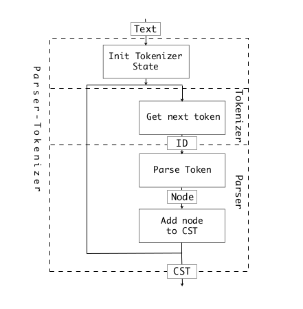

# Python3 Parser

## The tokenizer and parser module
In pgen we explored how to create the grammar file graminit.h, gramminit.c, this chapter will explore how the tokenizer and parser work together to create the AST. Let's start from the function PyParser_ParseFileObject (in Parser/parsetok.c)

```c++ parsetok.c
164 node *
165 PyParser_ParseFileObject(FILE *fp, PyObject *filename,
166                          const char *enc, grammar *g, int start,
167                          const char *ps1, const char *ps2,
168                          perrdetail *err_ret, int *flags)
169 {
170     struct tok_state *tok;
171 
172     if (initerr(err_ret, filename) < 0)
173         return NULL;
174 
175     if (PySys_Audit("compile", "OO", Py_None, err_ret->filename) < 0) {
176         return NULL;
177     }
178 
179     if ((tok = PyTokenizer_FromFile(fp, enc, ps1, ps2)) == NULL) {
180         err_ret->error = E_NOMEM;
181         return NULL;
182     }
183     if (*flags & PyPARSE_TYPE_COMMENTS) {
184         tok->type_comments = 1;
185     }
186     Py_INCREF(err_ret->filename);
187     tok->filename = err_ret->filename;
188     return parsetok(tok, g, start, err_ret, flags);
189 }

```
The grammar *g is the grammar struct generated by pgen, PyParser_ParseFileObject first creates a tokenizer PyTokenizer_FromFile, and passes it with g to the function parsetok.

```c++
212 /* Parse input coming from the given tokenizer structure.
213    Return error code. */
214 
215 static node *
216 parsetok(struct tok_state *tok, grammar *g, int start, perrdetail *err_ret,
217          int *flags)
```

parsetok creates a parser, using the grammar g
```c++ 
232     /* create a parser and install the accelerator, 
233      * accelerator can index the next state much faster. */
234     if ((ps = PyParser_New(g, start)) == NULL) {
235         err_ret->error = E_NOMEM;
236         growable_comment_array_deallocate(&type_ignores);
237         PyTokenizer_Free(tok);
238         return NULL;
239     }
```

parsetok then get the token by calling PyTokenizer_Get
```c++
247     for (;;) {
248         const char *a, *b;
249         int type;
250         size_t len;
251         char *str;
252         col_offset = -1;
253         int lineno;
254         const char *line_start;
255 
256         type = PyTokenizer_Get(tok, &a, &b);
257 
258         len = (a != NULL && b != NULL) ? b - a : 0;
259         str = (char *) PyObject_MALLOC(len + 1);
260         if (str == NULL) {
261             err_ret->error = E_NOMEM;
262             break;
263         }
264         if (len > 0)
265             strncpy(str, a, len);
266         str[len] = '\0';
```

if the token is valid, then PyParser_AddToken will add the token into the parser
for constructing the AST
```c++
337         if ((err_ret->error =
338              PyParser_AddToken(ps, (int)type, str,
339                                lineno, col_offset, tok->lineno, end_col_offset,
340                                &(err_ret->expected))) != E_OK) {
341             if (tok->done == E_EOF && !ISWHITESPACE(type)) {
342                 tok->done = E_SYNTAX;
343             }
344             if (err_ret->error != E_DONE) {
345                 PyObject_FREE(str);
346                 err_ret->token = type;
347             }
348             break;
349         }
350     }
```

returns the AST if the AST has been construct correctly.
```c++
459 done:
460     PyTokenizer_Free(tok);
461 
462     if (n != NULL) {
463         _PyNode_FinalizeEndPos(n);
464     }
465     return n;
```
The parsing process can be viewed in this image. 


